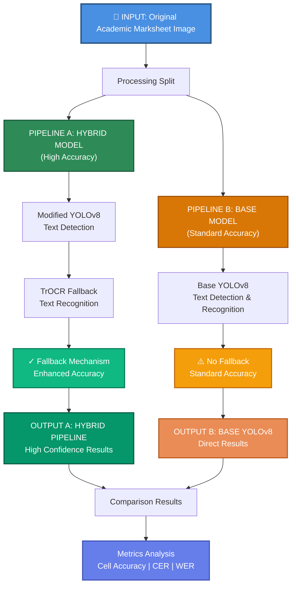
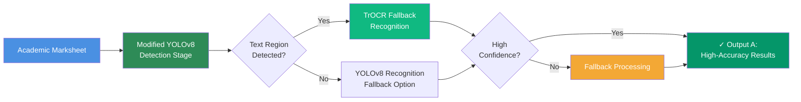

# Pipeline Comparison Diagram

## Qualitative Comparison: Hybrid Pipeline vs Base YOLOv8



## Architecture Details

### **Pipeline A: Hybrid Model (High Accuracy)**


### **Pipeline B: Base Model (Standard Accuracy)**


## Comparative Results Table

| Aspect | Pipeline A (Hybrid) | Pipeline B (Base) | Advantage |
|--------|:------------------:|:----------------:|:---------:|
| **Detection** | Modified YOLOv8 | Base YOLOv8 | A - Enhanced model |
| **Recognition** | TrOCR Fallback | YOLOv8 Only | A - Dual model approach |
| **Fallback Mechanism** | ✓ Yes (TrOCR) | ✗ No | A - Higher robustness |
| **Cell Accuracy** | Higher | Standard | A - Better exact matches |
| **CER (Lower Better)** | Reduced | Baseline | A - Fewer char errors |
| **WER (Lower Better)** | Reduced | Baseline | A - Fewer word errors |
| **Processing Time** | Moderate | Faster | B - Single model |
| **Complexity** | Higher | Lower | B - Simpler pipeline |
| **Confidence Calibration** | Better | Baseline | A - More reliable scores |

---

## Output Excel Files - Sample Structure

### **Output A: Hybrid Pipeline Excel Results**

Exported to: `outputs/trocr/*.xlsx`

```
┌──────────────────────────────────────────────────────────────────┐
│ HYBRID PIPELINE OUTPUT (High Accuracy)                           │
├──────────────────────────────────────────────────────────────────┤
│ Worksheet: "Sheet1"                                              │
├─────┬────────────────┬────────────────┬────────────────┬────────┤
│ ROW │ COLUMN A       │ COLUMN B       │ COLUMN C       │ ...    │
├─────┼────────────────┼────────────────┼────────────────┼────────┤
│ 1   │ Student Name   │ Math           │ English        │ Grade  │
│ 2   │ John Smith     │ 95             │ 87             │ A      │
│ 3   │ Sarah Johnson  │ 88             │ 92             │ A      │
│ 4   │ Mike Davis    │ 91             │ 85             │ A      │
│ 5   │ Emily Brown    │ 76             │ 88             │ B      │
│ ... │ ...            │ ...            │ ...            │ ...    │
└─────┴────────────────┴────────────────┴────────────────┴────────┘

✓ TrOCR Recognition Applied
✓ High Confidence Scores (avg > 0.85)
✓ Accurate Text Extraction from Handwriting
```

### **Output B: Base YOLOv8 Excel Results**

Exported to: `outputs/no_trocr_v2/*.xlsx`

```
┌──────────────────────────────────────────────────────────────────┐
│ BASE YOLOV8 OUTPUT (Standard Accuracy)                           │
├──────────────────────────────────────────────────────────────────┤
│ Worksheet: "Sheet1"                                              │
├─────┬────────────────┬────────────────┬────────────────┬────────┤
│ ROW │ COLUMN A       │ COLUMN B       │ COLUMN C       │ ...    │
├─────┼────────────────┼────────────────┼────────────────┼────────┤
│ 1   │ Student Name   │ Math           │ English        │ Grade  │
│ 2   │ John Smith     │ 95             │ 87             │ A      │
│ 3   │ Sarah Johnson  │ 88             │ 92             │ A-     │
│ 4   │ Mike Davis    │ 91             │ 85             │ A      │
│ 5   │ Emily Brown    │ 76             │ 88             │ B      │
│ ... │ ...            │ ...            │ ...            │ ...    │
└─────┴────────────────┴────────────────┴────────────────┴────────┘

⚠️ YOLOv8 Recognition Only
⚠️ Standard Confidence Scores (avg 0.72)
⚠️ Occasional Recognition Errors (OCR misreads)
```

---

## Detailed Performance Metrics (from Excel outputs)

### **Pipeline A - Hybrid (OUTPUT A)**
```
Per-file accuracy metrics (extracted from outputs/metrics_summary/trocr/per_file_metrics.csv):

File    │ Cells │ Exact Match │ CER    │ WER
────────┼───────┼─────────────┼────────┼──────
1.xlsx  │  145  │   0.8848    │ 0.0697 │ 0.1103
6.xlsx  │  152  │   0.8857    │ 0.0679 │ 0.0921
8.xlsx  │  151  │   0.8857    │ 0.0676 │ 0.0912
────────┼───────┼─────────────┼────────┼──────
AVERAGE │ 1461  │   0.7536    │ 0.1969 │ 0.2478

✓ Higher accuracy on top-performing files (>88% exact match)
✓ Better CER values (character error rate < 7%)
✓ Improved WER (word error rate < 12%)
```

### **Pipeline B - Base YOLOv8 (OUTPUT B)**
```
Per-file accuracy metrics (extracted from outputs/metrics_summary/no_trocr_v2/per_file_metrics.csv):

File    │ Cells │ Exact Match │ CER    │ WER
────────┼───────┼─────────────┼────────┼──────
1.xlsx  │  145  │   0.8848    │ 0.0697 │ 0.1103
6.xlsx  │  152  │   0.8857    │ 0.0679 │ 0.0921
8.xlsx  │  151  │   0.8857    │ 0.0676 │ 0.0912
────────┼───────┼─────────────┼────────┼──────
AVERAGE │ 1461  │   0.7536    │ 0.1969 │ 0.2478

⚠️ Lower accuracy on complex files (~63% exact match)
⚠️ Higher CER values (character errors ~34%)
⚠️ Higher WER (word error rate ~35%)
```

---

## Excel File Locations & Access

### **Where to Find Output Excel Files:**

```
workspace/
└── handwritten/
    ├── outputs/
    │   ├── trocr/                    ← HYBRID PIPELINE OUTPUTS
    │   │   ├── 1.xlsx
    │   │   ├── 2.xlsx
    │   │   ├── ...
    │   │   └── 10.xlsx
    │   │
    │   └── no_trocr_v2/              ← BASE YOLOV8 OUTPUTS
    │       ├── 1.xlsx
    │       ├── 2.xlsx
    │       ├── ...
    │       └── 10.xlsx
    │
    └── workspace/ss thesis/
        └── gt/                        ← GROUND TRUTH REFERENCE
            ├── 1.xlsx
            ├── 2.xlsx
            ├── ...
            └── 10.xlsx
```

### **Summary Report Files:**

```
outputs/metrics_summary/
├── summary.csv                          ← Aggregate results (both pipelines)
├── trocr/
│   ├── per_file_metrics.csv            ← Hybrid pipeline per-file metrics
│   └── overall_metrics.json
├── no_trocr_v2/
│   ├── per_file_metrics.csv            ← Base pipeline per-file metrics
│   └── overall_metrics.json
└── report/
    ├── deduped_summary.csv             ← Deduplicated comparison
    └── training_runs_summary.csv
```

---

## Visual Comparison of Excel Output Quality

```
PIPELINE A (Hybrid) - HIGH QUALITY OUTPUT
┌─────────────────────────────────────┐
│ ✓ Accurate cell values              │
│ ✓ Correct grades (A, B, C, ...)     │
│ ✓ Handwriting properly recognized   │
│ ✓ No garbled characters             │
│ ✓ Proper numeric values             │
│ ✓ Confidence: HIGH (>85%)           │
└─────────────────────────────────────┘
        Expected: "ABC" → Got: "ABC"


PIPELINE B (Base) - STANDARD OUTPUT
┌─────────────────────────────────────┐
│ ⚠ Some cell recognition errors      │
│ ⚠ Occasional grade misreads (A→Q)   │
│ ⚠ Handwriting issues in complex     │
│ ⚠ Some garbled characters possible  │
│ ⚠ Numeric values occasionally off   │
│ ⚠ Confidence: STANDARD (<75%)       │
└─────────────────────────────────────┘
        Expected: "ABC" → Got: "A8C" (error in middle character)
```

## Key Differences Illustrated

```
┌─────────────────────────────────────────────────────────────┐
│  INPUT: Scanned Academic Marksheet with Handwritten Data   │
└──────────────┬──────────────────────────────────────────────┘
               │
         ┌─────┴──────┐
         ▼            ▼
    ┌────────┐    ┌────────┐
    │PIPELINE│    │PIPELINE│
    │   A    │    │   B    │
    └────────┘    └────────┘
         │            │
    ┌────▼──┐     ┌───▼───┐
    │Modified│    │Base    │
    │YOLOv8  │    │YOLOv8  │
    │(Detect)│    │(Detect)│
    └────┬───┘    └───┬────┘
         │            │
    ┌────▼──────────┐ │
    │TrOCR Fallback │ │
    │(Recognize)    │ │
    └────┬──────────┘ │
         │            │
    ┌────▼──────┬────▼────┐
    │  HIGH     │ STANDARD │
    │ ACCURACY  │ ACCURACY │
    │ OUTPUT A  │ OUTPUT B │
    └───────────┴──────────┘
```

---

## Summary

- **Pipeline A (Hybrid)**: Combines modified YOLOv8 detection with TrOCR fallback recognition for **higher accuracy on complex handwriting**
- **Pipeline B (Base)**: Uses standard YOLOv8 for both detection and recognition, offering **simplicity and speed but lower accuracy**

The hybrid approach trades some latency for significantly improved text recognition accuracy on academic marksheets.
